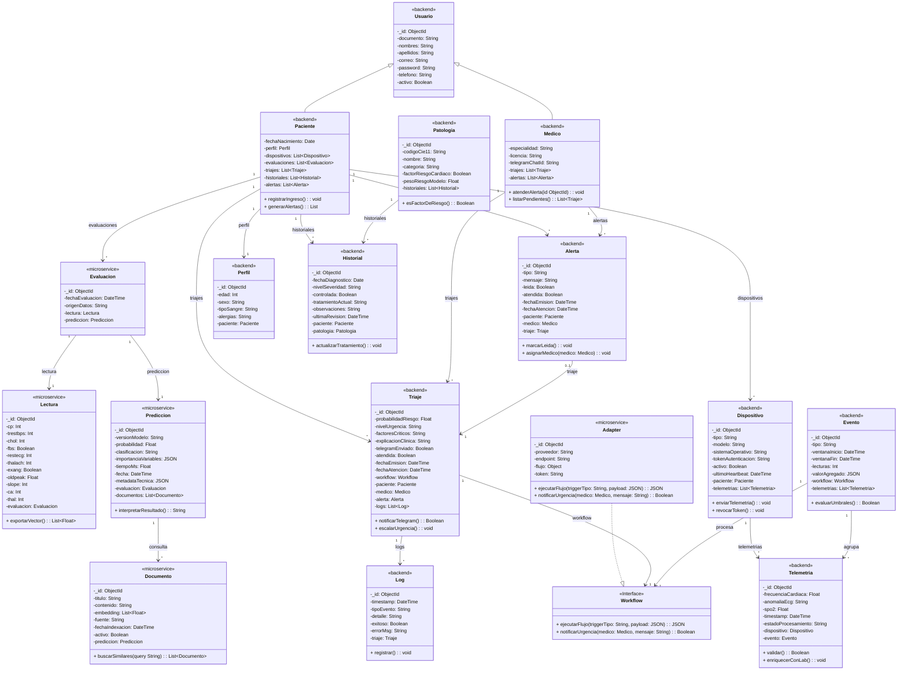

# Diagrama UML Original — Sistema de Triaje Cardiovascular IoT

**Fecha:** 2026-06-07
**Fuente:** Exportado desde Lucidchart (documento 2547e999-8026-4161-ac86-f46c584d174c)
**Nota:** Convertido desde PDF sin modificaciones.

---

