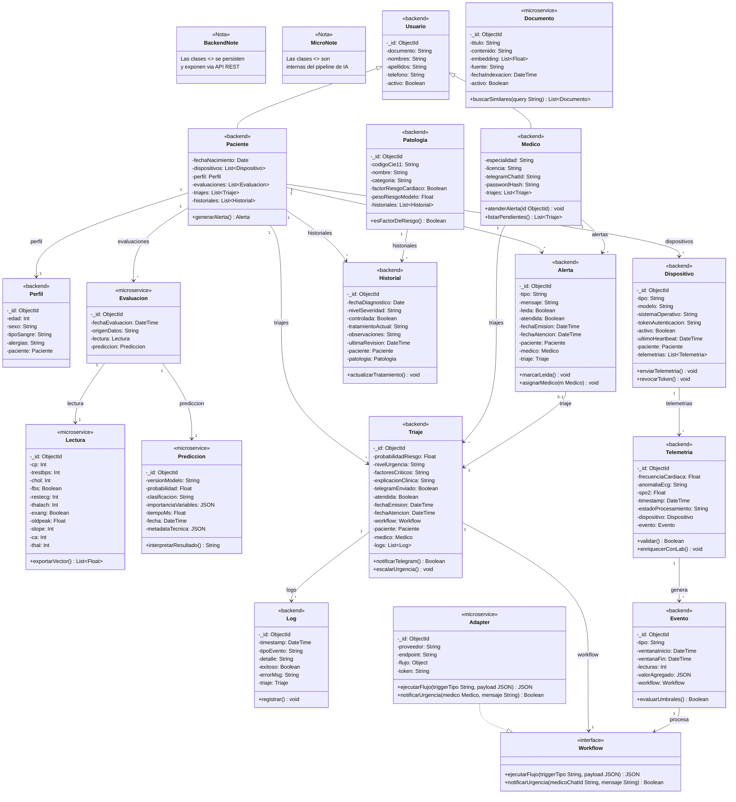

# Diagrama UML Original — Sistema de Triaje Cardiovascular IoT

**Fecha de conversión:** 2026-06-06
**Version:** 2.0 — Refactor de dominio
**Nota:** UML de clases del dominio. No incluye decisiones de infraestructura.

---

**Leyenda de estereotipos:**
- `<<backend>>` — Entidad persistida en el modulo Backend (API REST + SQL)
- `<<microservice>>` — Entidad procesada en el Microservicio de IA (LangChain + ML)
- `<<interface>>` — Contrato compartido entre modulos

---

