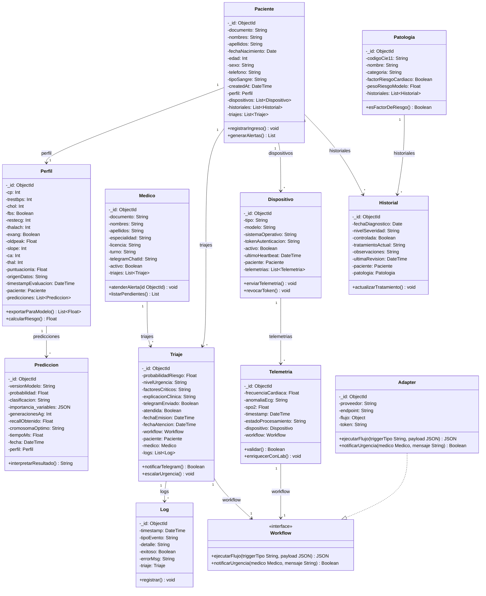

# Diagrama UML Original — Sistema de Triaje Cardiovascular IoT

**Fecha de conversión:** 2026-06-06  
**Nota:** Convertido desde PDF sin modificaciones. Cualquier discrepancia reportarla.

---

```mermaid
classDiagram
  direction TB

  class Prediccion {
    -_id: ObjectId
    -versionModelo: String
    -probabilidad: Float
    -clasificacion: String
    -importancia_variables: JSON
    -generacionesAg: Int
    -recallObtenido: Float
    -cromosomaOptimo: String
    -tiempoMs: Float
    -fecha: DateTime
    -perfil: Perfil
    +interpretarResultado() String
  }

  class Perfil {
    -_id: ObjectId
    -cp: Int
    -trestbps: Int
    -chol: Int
    -fbs: Boolean
    -restecg: Int
    -thalach: Int
    -exang: Boolean
    -oldpeak: Float
    -slope: Int
    -ca: Int
    -thal: Int
    -puntuacionIa: Float
    -origenDatos: String
    -timestampEvaluacion: DateTime
    -paciente: Paciente
    -predicciones: List~Prediccion~
    +exportarParaModelo() List~Float~
    +calcularRiesgo() Float
  }

  class Paciente {
    -_id: ObjectId
    -documento: String
    -nombres: String
    -apellidos: String
    -fechaNacimiento: Date
    -edad: Int
    -sexo: String
    -telefono: String
    -tipoSangre: String
    -createdAt: DateTime
    -perfil: Perfil
    -dispositivos: List~Dispositivo~
    -historiales: List~Historial~
    -triajes: List~Triaje~
    +registrarIngreso() void
    +generarAlertas() List
  }

  class Triaje {
    -_id: ObjectId
    -probabilidadRiesgo: Float
    -nivelUrgencia: String
    -factoresCriticos: String
    -explicacionClinica: String
    -telegramEnviado: Boolean
    -atendida: Boolean
    -fechaEmision: DateTime
    -fechaAtencion: DateTime
    -workflow: Workflow
    -paciente: Paciente
    -medico: Medico
    -logs: List~Log~
    +notificarTelegram() Boolean
    +escalarUrgencia() void
  }

  class Medico {
    -_id: ObjectId
    -documento: String
    -nombres: String
    -apellidos: String
    -especialidad: String
    -licencia: String
    -turno: String
    -telegramChatId: String
    -activo: Boolean
    -triajes: List~Triaje~
    +atenderAlerta(id ObjectId) void
    +listarPendientes() List
  }

  class Log {
    -_id: ObjectId
    -timestamp: DateTime
    -tipoEvento: String
    -detalle: String
    -exitoso: Boolean
    -errorMsg: String
    -triaje: Triaje
    +registrar() void
  }

  class Patologia {
    -_id: ObjectId
    -codigoCie11: String
    -nombre: String
    -categoria: String
    -factorRiesgoCardiaco: Boolean
    -pesoRiesgoModelo: Float
    -historiales: List~Historial~
    +esFactorDeRiesgo() Boolean
  }

  class Historial {
    -_id: ObjectId
    -fechaDiagnostico: Date
    -nivelSeveridad: String
    -controlada: Boolean
    -tratamientoActual: String
    -observaciones: String
    -ultimaRevision: DateTime
    -paciente: Paciente
    -patologia: Patologia
    +actualizarTratamiento() void
  }

  class Dispositivo {
    -_id: ObjectId
    -tipo: String
    -modelo: String
    -sistemaOperativo: String
    -tokenAutenticacion: String
    -activo: Boolean
    -ultimoHeartbeat: DateTime
    -paciente: Paciente
    -telemetrias: List~Telemetria~
    +enviarTelemetria() void
    +revocarToken() void
  }

  class Telemetria {
    -_id: ObjectId
    -frecuenciaCardiaca: Float
    -anomaliaEcg: String
    -spo2: Float
    -timestamp: DateTime
    -estadoProcesamiento: String
    -dispositivo: Dispositivo
    -workflow: Workflow
    +validar() Boolean
    +enriquecerConLab() void
  }

  class Workflow {
    <<interface>>
    +ejecutarFlujo(triggerTipo String, payload JSON) JSON
    +notificarUrgencia(medico Medico, mensaje String) Boolean
  }

  class Adapter {
    -_id: ObjectId
    -proveedor: String
    -endpoint: String
    -flujo: Object
    -token: String
    +ejecutarFlujo(triggerTipo String, payload JSON) JSON
    +notificarUrgencia(medico Medico, mensaje String) Boolean
  }

  %% ── Relaciones (exactamente como aparecen en el PDF) ──

  Perfil "1" --> "*" Prediccion : predicciones
  Paciente "1" --> "1" Perfil : perfil
  Paciente "1" --> "*" Triaje : triajes
  Paciente "1" --> "*" Dispositivo : dispositivos
  Paciente "1" --> "*" Historial : historiales
  Medico "1" --> "*" Triaje : triajes
  Triaje "1" --> "*" Log : logs
  Patologia "1" --> "*" Historial : historiales
  Dispositivo "1" --> "*" Telemetria : telemetrias
  Telemetria "1" --> "1" Workflow : workflow
  Triaje "1" --> "1" Workflow : workflow
  Adapter ..|> Workflow
```
