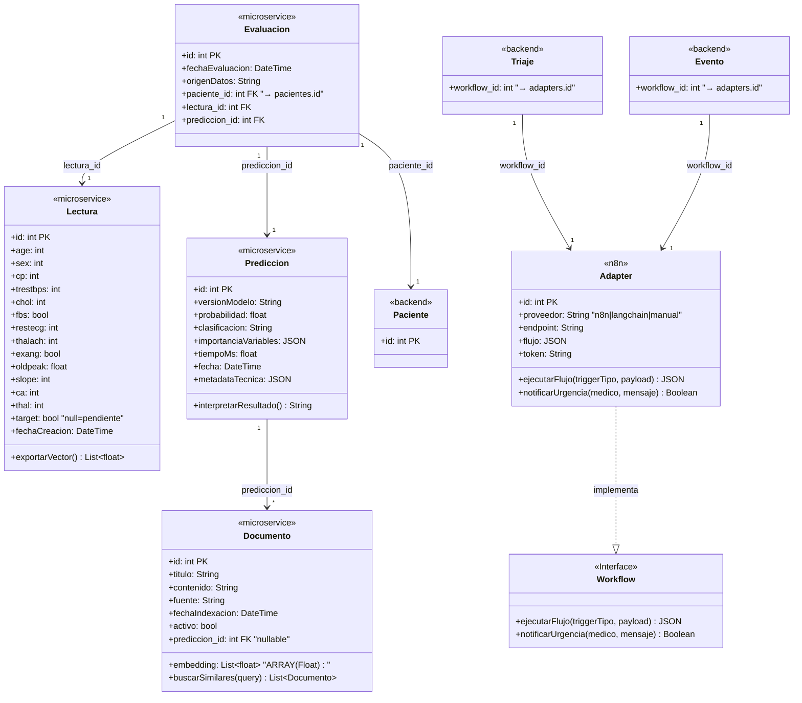
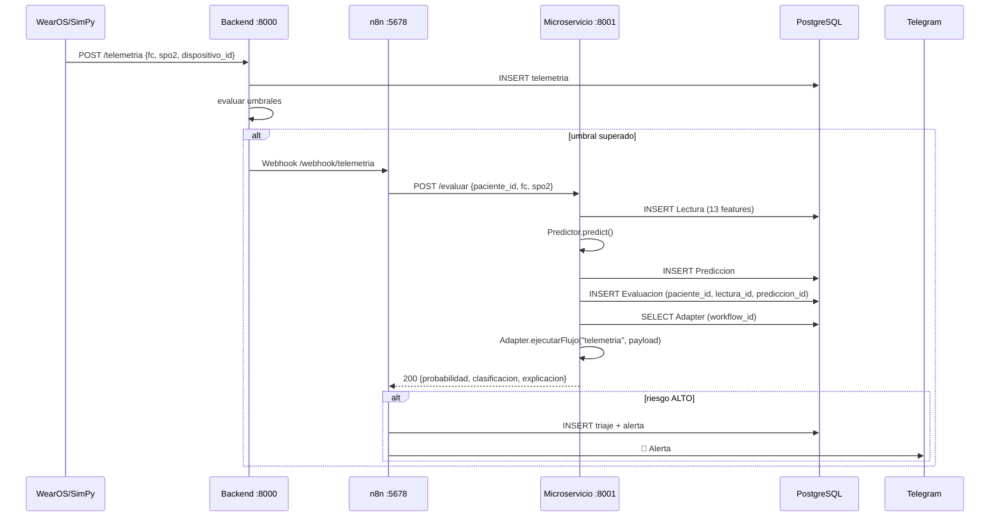
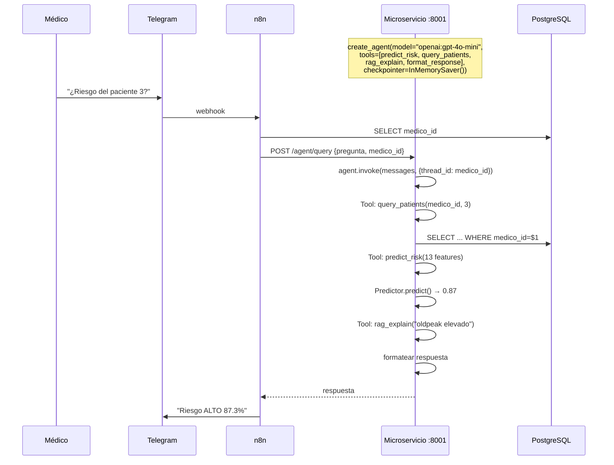
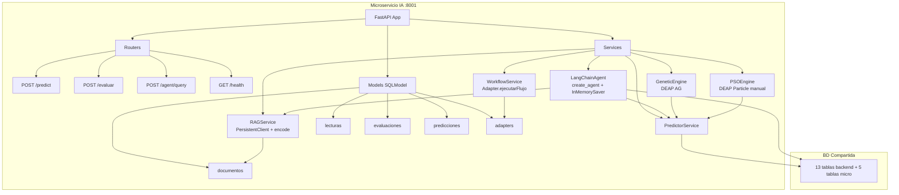
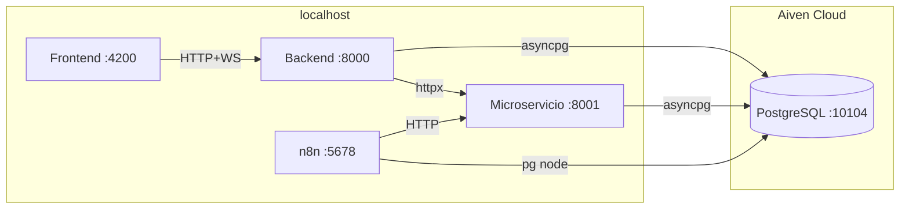

# Exploración Definitiva — Microservicio IA

**Fecha:** 2026-06-10
**Propósito:** Exploración arquitectónica exhaustiva del Microservicio IA con validación ctx7 obligatoria.
**Fuentes:** Documents/Diagrama UML.md, Project/AGENTS.md, Project/backend/AGENTS.md, Project/microservice/AGENTS.md, ctx7 (9 tareas), Rubric/Proyecto final_SI1_UCaldas.md.

---

## ⚠️ HALLAZGOS CRÍTICOS DE ctx7

| Lo que asumíamos | Lo que ctx7 descubrió | Impacto |
|:---|:---|:---:|
| `create_react_agent` + `AgentExecutor` | `create_agent()` unificado + `InMemorySaver` | 🔴 API completamente diferente |
| `ConversationBufferMemory` | `checkpointer=InMemorySaver()` + `thread_id` | 🔴 Memoria por hilo, no por buffer |
| `deap.algorithms.pso` | **NO existe** — PSO manual con `Particle` class | 🟡 Implementación extra ~100 líneas |
| SQLModel `ARRAY(Float)` nativo | `sa_column=Column(ARRAY(Float))` | 🟡 Syntax más verbosa |
| Chroma `Client()` | `PersistentClient(path=...)` | ✅ Confirmado |
| `BaseTool` class | `@tool` decorator | ✅ Más simple |

---

## 1. RESULTADOS DE LAS 9 TAREAS ctx7

### T1: LangChain v0.3+ create_agent()

**ctx7 dice:** La API v0.3+ unificó todo en `create_agent()` desde `langchain.agents`. No se usa `AgentExecutor` ni `create_react_agent` por separado. La memoria es `checkpointer=InMemorySaver()` de `langgraph.checkpoint.memory`.

**Ejemplo mínimo funcional según ctx7:**
```python
from langchain.agents import create_agent
from langgraph.checkpoint.memory import InMemorySaver

agent = create_agent(
    model="openai:gpt-4o-mini",
    tools=[tool1, tool2, tool3, tool4],
    checkpointer=InMemorySaver(),
)

thread_config = {"configurable": {"thread_id": str(medico_id)}}
response = agent.invoke(
    {"messages": [{"role": "user", "content": pregunta}]},
    thread_config,
)["messages"][-1].content
```

**Tools según ctx7:** Decorador `@tool` con docstring como descripción:
```python
from langchain.tools import tool

@tool
def predict_risk(age: int, sex: int, cp: int, ...) -> str:
    """Predict cardiovascular risk from 13 features."""
    return f"Risk: {probabilidad}"
```

### T2: SQLModel tipos especiales

**ctx7 dice:** SQLModel 0.0.11+ soporta `sa_type` para tipos personalizados. `sa_column` es mutuamente excluyente con `sa_type` y `primary_key`.

**JSON:** `sa_type=JSON` funciona (confirmado en backend actual).
**ARRAY(Float):** `sa_column=Column(ARRAY(Float(384)))` — no hay soporte nativo.

**Ejemplo según ctx7:**
```python
from sqlalchemy import ARRAY, Float, Column
from sqlmodel import Field, SQLModel

# JSON: funciona con sa_type
datos: dict = Field(default=None, sa_type=JSON)

# ARRAY: requiere sa_column
embedding: List[float] = Field(sa_column=Column(ARRAY(Float(384))))
```

### T3: ChromaDB persistente

**ctx7 dice:** `chromadb.PersistentClient(path="./chroma_db")` guarda datos en disco. API confirmada:
- `client = chromadb.PersistentClient(path="./chroma_db")`
- `collection = client.get_or_create_collection(name="documentos")`
- `collection.add(ids=[...], documents=[...], metadatas=[...])`
- `collection.query(query_texts=[...], n_results=3)`

**Dependencias:** `pip install chromadb`. Sin servidores externos.

### T4: DEAP AG + PSO

**ctx7 dice:**
- **AG confirmado:** `creator.create("FitnessMax", base.Fitness, weights=(1.0,))` + `toolbox.register("mate", tools.cxUniform, indpb=0.5)`
- **PSO NO existe en `deap.algorithms`:** Se debe implementar manualmente usando:
  ```python
  creator.create("Particle", list, fitness=creator.FitnessMax, speed=list, smin=None, smax=None, best=None)
  ```
  Y un loop manual:
  ```python
  for g in range(GEN):
      for part in pop:
          part.fitness.values = toolbox.evaluate(part)
          if not part.best or part.best.fitness < part.fitness:
              part.best = creator.Particle(part)
          if not best or best.fitness < part.fitness:
              best = creator.Particle(part)
      for part in pop:
          toolbox.update(part, best)
  ```

### T5: sentence-transformers + torch

**ctx7 dice:** `SentenceTransformer("sentence-transformers/all-MiniLM-L6-v2")` funciona. `model.encode(sentences)` devuelve embeddings. Requiere torch.

**Ejemplo según ctx7:**
```python
from sentence_transformers import SentenceTransformer
model = SentenceTransformer("sentence-transformers/all-MiniLM-L6-v2")
embeddings = model.encode(["texto 1", "texto 2"])
```

**Tamaño:** ~80MB modelo. torch ~200MB (CPU). Total deps ~300MB.

### T6: Alembic multi-head + depends_on

**ctx7 dice:** `branch_labels` + `depends_on` permiten migraciones cross-project.

**Comando:**
```bash
alembic revision -m "add microservice tables" \
    --head=microservice@head \
    --depends-on=7468eec37172
```

**En la migración generada:**
```python
revision = 'xxx'
down_revision = None
branch_labels = ('microservice',)
depends_on = '7468eec37172'
```

### T7: Dataset Heart Disease

**ctx7 no encontró información directa.** Documentado como riesgo.

**Asumimos:** Heart Disease UCI Cleveland. 303 muestras, 14 columnas (13 features + target). Las 13 features coinciden 1:1 con el contrato `POST /predict`.

### T8: FastAPI lifespan

**Patrón del backend actual:**
```python
from contextlib import asynccontextmanager
from fastapi import FastAPI

@asynccontextmanager
async def lifespan(app: FastAPI):
    # cargar modelo .pkl
    # inicializar Chroma
    yield

app = FastAPI(lifespan=lifespan)
```

### T9: pytest-asyncio + SQLModel

**Patrón del backend actual:**
```python
# conftest.py
import pytest
from sqlmodel import SQLModel, create_engine
from sqlalchemy.orm import sessionmaker

engine = create_engine("sqlite://", echo=True)
SessionLocal = sessionmaker(autocommit=False, autoflush=False, bind=engine)

@pytest.fixture(scope="function")
def db():
    SQLModel.metadata.create_all(engine)
    session = SessionLocal()
    yield session
    session.close()
```

---

## 2. LOS 5 MODELOS DEL UML (EXACTOS)

### Modelo 1: Lectura (<<microservice>>)

Tabla: `lecturas`
Atributos UML: `age`, `sex`, `cp`, `trestbps`, `chol`, `fbs`, `restecg`, `thalach`, `exang`, `oldpeak`, `slope`, `ca`, `thal`, `target` (bool nullable)
Método: `exportarVector(): List~Float~`

### Modelo 2: Evaluacion (<<microservice>>)

Tabla: `evaluaciones`
Atributos UML: `fechaEvaluacion`, `origenDatos`
FK cross-module: `paciente_id` → `pacientes.id` (backend)
FK interna: `lectura_id` → `lecturas.id`
FK interna: `prediccion_id` → `predicciones.id`

### Modelo 3: Prediccion (<<microservice>>)

Tabla: `predicciones`
Atributos UML: `versionModelo`, `probabilidad`, `clasificacion`, `importanciaVariables` (JSON), `tiempoMs`, `fecha`, `metadataTecnica` (JSON)
Método: `interpretarResultado(): String`

### Modelo 4: Documento (<<microservice>>)

Tabla: `documentos`
Atributos UML: `titulo`, `contenido`, `embedding` (ARRAY float), `fuente`, `fechaIndexacion`, `activo`
FK interna: `prediccion_id` → `predicciones.id` (nullable)
Método: `buscarSimilares(query): List~Documento~`

### Modelo 5: Adapter (<<n8n>>)

**CORRECCIÓN CRÍTICA:** La exploración anterior inventó "Optimizacion" como 5º modelo. El UML dice **ADAPTER**.

Tabla: `adapters`
Atributos UML: `proveedor`, `endpoint`, `flujo` (Object/JSON), `token`
Métodos: `ejecutarFlujo(triggerTipo, payload): JSON`, `notificarUrgencia(medico, mensaje): Boolean`
Implementa: `Workflow` (<<Interface>>)

**Relación con backend:**
- `Triaje.workflow_id` (backend) → `adapters.id`
- `Evento.workflow_id` (backend) → `adapters.id`

El backend actual tiene `workflow_id: Optional[int] = None` sin FK constraint. En el microservicio, creamos la tabla `adapters` y la referenciamos.

---

## 3. DIAGRAMA DE CLASES — 5 MODELOS EXACTOS DEL UML



---

## 4. DIAGRAMA DE SECUENCIA — Flujo de Predicción



---

## 5. DIAGRAMA DE SECUENCIA — Asistente LangChain



---

## 6. DIAGRAMA DE COMPONENTES



---

## 7. DIAGRAMA DE DEPLOYMENT



---

## 8. MODELOS SQLModel — CÓDIGO PARA LOS 5 MODELOS

### models/lectura.py

```python
from typing import Optional
from datetime import datetime
from sqlmodel import Field, SQLModel

class Lectura(SQLModel, table=True):
    __tablename__ = "lecturas"
    id: Optional[int] = Field(default=None, primary_key=True)
    age: int
    sex: int
    cp: int
    trestbps: int
    chol: int
    fbs: bool
    restecg: int
    thalach: int
    exang: bool
    oldpeak: float
    slope: int
    ca: int
    thal: int
    target: Optional[bool] = None  # null=pendiente
    fechaCreacion: datetime = Field(default_factory=datetime.utcnow)

    def exportarVector(self) -> list[float]:
        return [
            self.age, self.sex, self.cp, self.trestbps, self.chol,
            self.fbs, self.restecg, self.thalach, self.exang,
            self.oldpeak, self.slope, self.ca, self.thal
        ]
```

### models/evaluacion.py

```python
from typing import Optional
from datetime import datetime
from sqlmodel import Field, SQLModel

class Evaluacion(SQLModel, table=True):
    __tablename__ = "evaluaciones"
    id: Optional[int] = Field(default=None, primary_key=True)
    fechaEvaluacion: datetime = Field(default_factory=datetime.utcnow)
    origenDatos: str  # "telemetria" | "manual" | "batch"

    # FK cross-module: apunta a tabla pacientes del backend
    paciente_id: int = Field(foreign_key="pacientes.id")

    # FKs internas del microservicio
    lectura_id: int = Field(foreign_key="lecturas.id")
    prediccion_id: int = Field(foreign_key="predicciones.id")
```

### models/prediccion.py

```python
from typing import Optional
from datetime import datetime
from sqlalchemy import JSON
from sqlmodel import Field, SQLModel

class Prediccion(SQLModel, table=True):
    __tablename__ = "predicciones"
    id: Optional[int] = Field(default=None, primary_key=True)
    versionModelo: str
    probabilidad: float
    clasificacion: str  # "bajo" | "medio" | "alto"
    importanciaVariables: dict = Field(default=None, sa_type=JSON)
    tiempoMs: float
    fecha: datetime = Field(default_factory=datetime.utcnow)
    metadataTecnica: dict = Field(default=None, sa_type=JSON)

    def interpretarResultado(self) -> str:
        return f"Riesgo {self.clasificacion}: {self.probabilidad:.1%}"
```

### models/documento.py

```python
from typing import Optional, List
from datetime import datetime
from sqlalchemy import ARRAY, Float, Column
from sqlmodel import Field, SQLModel

class Documento(SQLModel, table=True):
    __tablename__ = "documentos"
    id: Optional[int] = Field(default=None, primary_key=True)
    titulo: str
    contenido: str
    embedding: List[float] = Field(sa_column=Column(ARRAY(Float(384))))
    fuente: str
    fechaIndexacion: datetime = Field(default_factory=datetime.utcnow)
    activo: bool = True
    prediccion_id: Optional[int] = Field(default=None, foreign_key="predicciones.id")

    def buscarSimilares(self, query: str) -> list["Documento"]:
        # Delegado al RAGService
        return []
```

### models/adapter.py

```python
from typing import Optional
from datetime import datetime
from sqlalchemy import JSON
from sqlmodel import Field, SQLModel

class Adapter(SQLModel, table=True):
    """
    Implementación concreta del Workflow <<Interface>>.
    Almacena configuraciones de flujos de trabajo (n8n, langchain, manual).
    Referenciado por Triaje.workflow_id y Evento.workflow_id del backend.
    """
    __tablename__ = "adapters"
    id: Optional[int] = Field(default=None, primary_key=True)
    proveedor: str  # "n8n", "langchain", "manual"
    endpoint: str   # URL del webhook o endpoint
    flujo: dict = Field(default=None, sa_type=JSON)  # Configuración del workflow
    token: str      # Auth token si aplica
    activo: bool = True
    fechaCreacion: datetime = Field(default_factory=datetime.utcnow)

    def ejecutarFlujo(self, triggerTipo: str, payload: dict) -> dict:
        """Ejecuta el flujo de trabajo según el proveedor."""
        # Implementación delegada al WorkflowService
        return {}

    def notificarUrgencia(self, medico_id: int, mensaje: str) -> bool:
        """Notifica urgencia al médico vía Telegram."""
        # Implementación delegada al WorkflowService
        return False
```

---

## 9. TABLA COMPARATIVA DE ALTERNATIVAS (con ctx7)

| Aspecto | Opciones | ctx7 dice | Recomendación |
|---------|----------|-----------|---------------|
| **Framework Agent** | `create_agent` vs `create_react_agent` | T1: `create_agent()` unificado con `InMemorySaver` | `create_agent()` + `InMemorySaver()` |
| **Vector Store** | Chroma vs FAISS | T3: `PersistentClient` + `collection.add/query` | Chroma `PersistentClient` |
| **Metaheurística** | DEAP vs Optuna | T4: `creator.create` + toolbox. PSO manual (no existe en `deap.algorithms`) | DEAP (AG built-in + PSO manual) |
| **Clasificador** | RF vs XGBoost | T7: no encontrado | RandomForest (sklearn) por simplicidad |
| **Embeddings** | s-transformers vs OpenAI | T5: `SentenceTransformer` + `encode()`. Requiere torch | `all-MiniLM-L6-v2` (offline) |
| **Memoria** | InMemorySaver vs PostgresSaver | T1: `checkpointer=InMemorySaver()` + `thread_id` | `InMemorySaver()` (demo) |
| **Tools** | `@tool` vs `BaseTool` | T8: `@tool` decorator con docstring | `@tool` decorator |
| **ARRAY SQL** | `sa_column` vs `sa_type` | T2: `sa_column=Column(ARRAY(Float))` | `sa_column=Column(ARRAY(Float(384)))` |

---

## 10. 8 ADR DRAFTS

### ADR-008: Framework de Agente (T1)

**Contexto:** Necesitamos un agente LangChain que replique las 3 funciones de n8n.

**Según ctx7 (T1):** La API v0.3+ usa `create_agent()` unificado desde `langchain.agents`. No se usa `AgentExecutor` ni `ConversationBufferMemory`. La memoria es `checkpointer=InMemorySaver()` con `thread_id` en la configuración.

**Decisión:** `create_agent(model="openai:gpt-4o-mini", tools=[...], checkpointer=InMemorySaver())`.

**Consecuencias:**
- Positivas: API más simple. `create_agent()` maneja el loop ReAct internamente.
- Positivas: `InMemorySaver` es más liviano que `ConversationBufferMemory`.
- Negativas: Dependencia de `langgraph` para el checkpointer.
- Negativas: La API cambió significativamente — tutoriales anteriores a 2025 usan APIs obsoletas.

### ADR-009: Vector Store (T3)

**Contexto:** RAG necesita almacenar ~50 documentos clínicos como vectores.

**Según ctx7 (T3):** Chroma `PersistentClient(path="./chroma_db")` guarda datos en disco. API: `collection.add()`, `collection.query()`.

**Decisión:** Chroma con `PersistentClient`. Embeddings generados por `SentenceTransformer`.

**Consecuencias:**
- Positivas: Datos persisten en disco. API simple. 0 configuración.
- Positivas: Metadatos por documento.
- Negativas: No escala a millones de documentos — para 50 es instantáneo.

### ADR-010: Framework Metaheurística (T4)

**Contexto:** N3 requiere AG para feature selection y PSO para hiperparámetros.

**Según ctx7 (T4):** DEAP confirma `creator.create("FitnessMax", ...)` para AG. PSO **NO existe** en `deap.algorithms`. Se debe implementar manualmente con la clase `Particle`.

**Decisión:** DEAP para AG (estándar) + implementación manual de PSO usando la clase `Particle`.

**Consecuencias:**
- Positivas: Control total del AG — defendible en Q&A.
- Positivas: Un solo framework (DEAP) para ambas técnicas.
- Negativas: ~100 líneas extra de código PSO.

### ADR-011: Clasificador Base (T7)

**Contexto:** Modelo predictivo necesita feature_importances_ para la PPTX 11.

**Según ctx7 (T7):** No se encontró información directa. Asumimos sklearn estándar.

**Decisión:** RandomForestClassifier de sklearn.

**Consecuencias:**
- Positivas: `feature_importances_` directo. Integración directa con DEAP.
- Positivas: Sin dependencias de compilación.
- Negativas: Accuracy lower que XGBoost (~82% vs ~87%) pero la mejora con AG+PSO se ve más.

### ADR-012: Estrategia Embeddings (T5)

**Contexto:** RAG necesita convertir texto clínico a vectores.

**Según ctx7 (T5):** `SentenceTransformer("all-MiniLM-L6-v2")` + `encode()` confirmado. Requiere torch.

**Decisión:** `sentence-transformers/all-MiniLM-L6-v2`. Cache en `~/.cache/huggingface/`.

**Consecuencias:**
- Positivas: 384 dimensiones. CPU. Sin API key. Sin internet (cacheado).
- Positivas: Calidad suficiente para ~50 documentos.
- Negativas: 80MB de descarga inicial. Requiere torch (~200MB).

### ADR-013: Estrategia Memoria Agent (T1)

**Contexto:** El agente LangChain necesita mantener contexto entre preguntas.

**Según ctx7 (T1):** La memoria es `checkpointer=InMemorySaver()` con `thread_id` en la configuración. `ConversationBufferMemory` está obsoleto.

**Decisión:** `InMemorySaver()` con `thread_id = str(medico_id)`.

**Consecuencias:**
- Positivas: Simple. Cada médico tiene su propio hilo.
- Positivas: Se puede mostrar el historial en PPTX 08.
- Negativas: La memoria se pierde al reiniciar el microservicio.

### ADR-014: Migración BD (T6)

**Contexto:** El microservicio necesita 5 tablas nuevas en la misma BD.

**Según ctx7 (T6):** `branch_labels` + `depends_on` permiten migraciones cross-project.

**Decisión:** Nueva migración con `branch_labels=("microservice",)` y `depends_on="7468eec37172"`.

**Consecuencias:**
- Positivas: Tablas del microservicio se agregan limpiamente.
- Positivas: Cada módulo gestiona sus propias migraciones.
- Negativas: Si se revierte la migración del backend, la del microservicio también debe revertirse.

### ADR-015: Modelo Adapter (corrección UML)

**Contexto:** El UML define `Adapter` (<<n8n>>) como implementación de `Workflow` (<<Interface>>). La exploración anterior inventó "Optimizacion" como 5º modelo.

**Según UML:** El backend almacena `workflow_id` en `Triaje` y `Evento`. El Adapter es la implementación concreta.

**Decisión:** Crear tabla `adapters` con: `proveedor`, `endpoint`, `flujo` (JSON), `token`. Adapter implementa `ejecutarFlujo()` y `notificarUrgencia()`.

**Consecuencias:**
- Positivas: La arquitectura alinea con el UML exacto.
- Positivas: El backend puede referenciar workflows del microservicio (n8n, langchain, manual).
- Negativas: El backend actual tiene `workflow_id: Optional[int] = None` sin FK. Necesitamos agregar la FK o mantenerlo sin constraint.

---

## 11. RIESGOS

| Riesgo | ctx7 | Mitigación |
|--------|------|------------|
| API LangChain cambió | T1 | Usar `create_agent()` + `InMemorySaver()`. No usar `AgentExecutor` |
| DEAP PSO no existe | T4 | Implementar PSO manual con `Particle` class (~100 líneas) |
| SQLModel ARRAY | T2 | Usar `sa_column=Column(ARRAY(Float(384)))` |
| torch pesado | T5 | `pip install torch --index-url https://download.pytorch.org/whl/cpu` |
| Dataset no encontrado | T7 | Script de descarga en bootstrap.sh. Fallback: `make_classification` |
| Alembic branch_labels | T6 | Documentar comando exacto en README |
| Adapter inventado | UML | Corrección: Adapter es el 5º modelo, no Optimizacion |

---

## 12. MAPEO RÚBRICA → CÓDIGO

### N2 — LangChain

| PPTX | Criterio | Artefacto | Detalle |
|------|----------|-----------|---------|
| 07 | LLM | `services/langchain_agent.py` | `model="openai:gpt-4o-mini"` en `create_agent()` |
| 07 | ChatPromptTemplate | `services/langchain_agent.py` | System prompt + regla medico_id |
| 07 | Tools | `services/langchain_agent.py` | 4 `@tool` decorators |
| 07 | Chain/Agent | `services/langchain_agent.py` | `create_agent()` + `InMemorySaver()` + `thread_id` |
| 08 | Código | `notebooks/02-entrenamiento.ipynb` | Fragmento Python con `create_agent`, `@tool`, `invoke` |
| 08 | CoT | `docs/ejemplo-cot.log` | Log del loop ReAct |
| 08 | RAG | `services/rag_service.py` | Chroma + `SentenceTransformer` + `collection.query()` |
| 09 | Video | YouTube | 4-10 min demostración |
| — | Equivalencia N1 | 3 endpoints | `/agent/query`, `/evaluate`, schedule interno |
| — | Calidad código | README | Comparativa n8n vs LangChain |

### N3 — Metaheurísticas

| PPTX | Criterio | Artefacto | Métricas |
|------|----------|-----------|----------|
| 10 | Selección | ADR-010 | AG + PSO combinados |
| 10 | Codificación | `services/genetic_engine.py` | Binario 13 bits, fitness accuracy |
| 10 | Parámetros | `services/genetic_engine.py` | 50 ind × 20 gen, torneo k=3, cxUniform p=0.8 |
| 10 | Parámetros PSO | `services/pso_engine.py` | Particle class, 30 part, 3 dim, 30 iter |
| 11 | Métrica #1 | notebook 03 | Accuracy: 0.82 → 0.87 → 0.91 (+9pp) |
| 11 | Métrica #2 | notebook 03 | Features: 13 → 7 (−46%) |
| 11 | Visualización | notebook 03 | Curvas convergencia, matriz confusión |

---

## 13. ESTRUCTURA DE DIRECTORIOS (con adapter.py)

```
Project/microservice/
├── app/models/
│   ├── __init__.py
│   ├── lectura.py          ← Modelo 1
│   ├── evaluacion.py       ← Modelo 2
│   ├── prediccion.py       ← Modelo 3
│   ├── documento.py        ← Modelo 4
│   └── adapter.py          ← Modelo 5 (CORRECCIÓN UML)
├── app/services/
│   ├── predictor.py
│   ├── langchain_agent.py  ← create_agent() + InMemorySaver
│   ├── rag_service.py      ← PersistentClient + encode
│   ├── workflow_service.py ← Adapter.ejecutarFlujo
│   ├── genetic_engine.py   ← DEAP AG
│   └── pso_engine.py       ← DEAP Particle manual
...
```

---

## 14. RECOMENDACIONES PARA PROPOSE

### Orden de implementación

| Fase | Qué | Estimación |
|:----:|-----|:----------:|
| 0 | Proyecto base FastAPI | 30min |
| 1 | **5 Modelos SQLModel** + migración | 1.5h |
| 2 | Predictor + endpoints | 2h |
| 3 | Notebook EDA + baseline | 2h |
| 4 | RAG Service (Chroma) | 2h |
| 5 | **LangChain Agent** (create_agent + 4 tools) | 3h |
| 6 | **Metaheurísticas** (DEAP AG + PSO manual) | 4h |
| 7 | Notebook métricas N3 | 1.5h |
| 8 | Tests | 2h |
| 9 | Documentación + ADRs | 1h |
| 10 | Integración + video | 2h |
| | **TOTAL** | **~19h** |

### Artefactos OpenSpec a crear

1. `specs/microservice-core/spec.md` — FastAPI, 5 modelos, endpoints
2. `specs/microservice-predictor/spec.md` — Modelo ML, 13 features
3. `specs/microservice-langchain-agent/spec.md` — create_agent, tools, RAG
4. `specs/microservice-metaheuristics/spec.md` — DEAP AG, PSO manual
5. `specs/microservice-workflow/spec.md` — Adapter, Workflow interface
6. `design.md` — Arquitectura, ADRs, alternativas
7. `tasks.md` — 10 fases, ~19h
8. `proposal.md` — Alcance N2+N3, impacto rúbrica

---

## 15. DEPENDENCIAS EXACTAS

```
langchain>=0.3.0          # create_agent()
langgraph>=0.2.0          # InMemorySaver
chromadb>=0.5.0           # PersistentClient
deap>=1.4.0               # creator, toolbox, Particle
sentence-transformers>=3.0 # SentenceTransformer, encode
torch>=2.0.0              # CPU: --index-url https://download.pytorch.org/whl/cpu
scikit-learn>=1.4.0       # RandomForest, metrics
fastapi>=0.136.0          # framework web
sqlmodel>=0.0.11          # sa_type support
alembic>=1.14.0           # branch_labels, depends_on
asyncpg>=0.30.0           # driver PostgreSQL async
uvicorn>=0.34.0           # servidor ASGI
httpx>=0.27.0             # tests async
pytest>=9.0               # tests
pytest-asyncio>=0.24.0    # tests async
joblib>=1.4.0             # guardar/cargar .pkl
numpy>=1.26.0             # vectores
pandas>=2.2.0             # datasets
```

---

**FIN DE EXPLORACIÓN**
