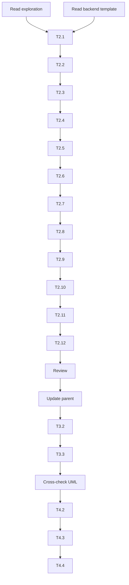

# Tasks.md

## Overview

Implementation plan for generating the microservice AGENTS.md documentation. Pure documentation task — no code changes.

## Tasks

### Phase 1: Preparation

- [x] **T1.1** Read `exploracion-definitiva.md` and extract:
  - Stack validated with ctx7 (T1-T9)
  - 5 UML models with exact attributes
  - Endpoints (POST /predict, /evaluar, /agent/query, GET /health)
  - Conventions (snake_case, singular, plural, _service suffix)
  - Cross-module relationships (paciente_id, workflow_id)
  - ADRs 008-015
  - N2 and N3 rubric mapping

- [x] **T1.2** Read `backend/AGENTS.md` as template and note:
  - Section order (Stack → Architecture → Endpoints → Communication → Conventions → BD → Decisions → Mapeo)
  - Table formats (stack table, endpoints table, mapeo table)
  - Directory tree style
  - ASCII diagram style
  - Heading levels

### Phase 2: Draft microservice/AGENTS.md

- [x] **T2.1** Write header and one-liner
  - `# AGENTS.md — Microservicio IA`
  - One-liner: FastAPI + LangChain + Metaheurísticas + RAG

- [x] **T2.2** Write Stack Tecnológico table
  - 11 rows (FastAPI, SQLModel, LangChain, ChromaDB, DEAP, sentence-transformers, scikit-learn, PostgreSQL, asyncpg, pytest, OpenAI)
  - Include version + purpose

- [x] **T2.3** Write Arquitectura section
  - Directory tree (match backend structure)
  - Layer descriptions (models, schemas, routers, services, core, utils)

- [x] **T2.4** Write Endpoints table
  - 6 rows (POST /predict, /evaluar, /agent/query, /agent/train, /workflow/trigger, GET /health)
  - Method, route, service, description

- [x] **T2.5** Write Comunicación section
  - ASCII diagram: Backend → httpx → Microservice, n8n → HTTP → Microservice
  - Bullet points for each communication channel

- [x] **T2.6** Write Convenciones section
  - Same as backend: snake_case, singular models, plural routers, _service suffix
  - Add microservice-specific: notebooks/, scripts/ directories

- [x] **T2.7** Write Base de Datos section
  - Same PostgreSQL as backend
  - 5 tables: lecturas, evaluaciones, predicciones, documentos, adapters
  - Migration: branch_labels + depends_on

- [x] **T2.8** Write Modelos SQLModel section
  - 5 models with exact UML attributes
  - Include FK relationships (cross-module and internal)
  - Include methods (exportarVector, interpretarResultado, buscarSimilares, ejecutarFlujo, notificarUrgencia)

- [x] **T2.9** Write Cobertura Rúbrica section
  - N2 table (8 rows: PPTX 07-09, LLM, ChatPromptTemplate, Tools, Chain/Agent, Código, CoT, RAG, Video)
  - N3 table (7 rows: PPTX 10-11, Selección, Codificación, Parámetros, Parámetros PSO, Métrica #1, Métrica #2, Visualización)

- [x] **T2.10** Write Decisiones Arquitectónicas section
  - List ADRs 008-015 with one-line summary each
  - Reference `exploracion-definitiva.md`

- [x] **T2.11** Write Mapeo UML → Código section
  - Table: concept → implementation
  - Include: classes, methods, relationships, JSON fields, ARRAY fields

- [x] **T2.12** Write Estructura de Directorios section
  - Full tree with file descriptions

- [x] **T2.13** Review and validate
  - Check all 5 models have exact UML attributes
  - Check rubric mapping completeness
  - Check ADR references
  - Check consistency with backend AGENTS.md

### Phase 3: Draft parent AGENTS.md update

- [x] **T3.1** Update microservice index line
  - Change: `Capa aislada de Inteligencia Artificial` → `FastAPI + LangChain + Metaheurísticas`
  - Add: `Predicción de riesgo cardiovascular (RandomForest), agente conversacional (RAG), y optimización (DEAP AG + PSO manual)`

- [x] **T3.2** Add Microservice Stack subsection
  - Add after main Stack section (around line 52)
  - 5 bullet points: LangChain, ChromaDB, DEAP, sentence-transformers, scikit-learn
  - Include version numbers

- [x] **T3.3** Review parent consistency
  - Ensure no broken links
  - Ensure style matches existing sections

### Phase 4: Final Review

- [x] **T4.1** Cross-check with UML
  - Read `Diagrama UML.md` lines 41-235
  - Verify each model attribute matches exactly

- [x] **T4.2** Cross-check with rubric
  - Read `Rubric/Proyecto final_SI1_UCaldas.md` sections 6-7
  - Verify N2 and N3 criteria are covered

- [x] **T4.3** Cross-check with exploration
  - Read `exploracion-definitiva.md` sections 1-2
  - Verify ctx7 findings are reflected

- [x] **T4.4** Final formatting
  - Ensure markdown renders correctly
  - Ensure tables are aligned
  - Ensure diagrams are valid

## Dependencies

## Time Estimate

| Phase | Tasks | Estimate |
|-------|-------|----------|
| 1 | T1.1, T1.2 | 5 min |
| 2 | T2.1 — T2.13 | 15 min |
| 3 | T3.1 — T3.3 | 5 min |
| 4 | T4.1 — T4.4 | 5 min |
| | **Total** | **30 min** |

## Notes

- No code generation in this change
- No new files outside `AGENTS.md`
- No directory creation
- Implementation will be in separate change

## Status

- **Phase:** PROPOSE
- **Ready for:** IMPLEMENT
